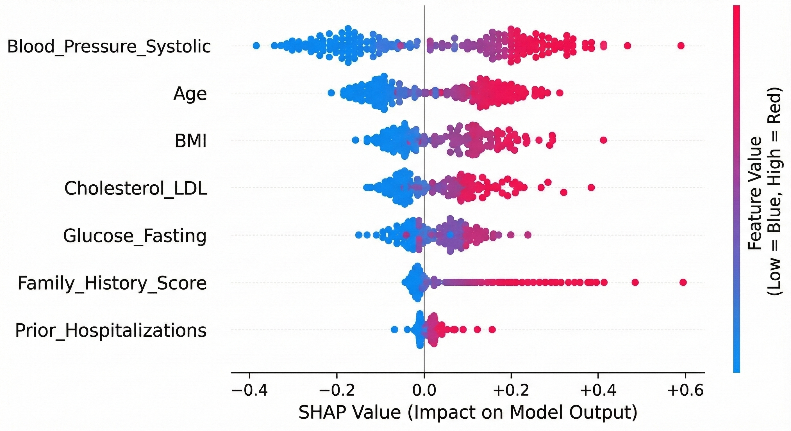

# Interpretable AI Auditor 🧬

### The Problem
During my Graduate Research, I discovered a **10% quantifiable performance gap** between AI and traditional diagnostics. I realized that without interpretability, AI adoption faces critical risks involving **data privacy and algorithmic bias**.

### My Solution
I developed this audit framework to move AI from a "Black Box" to a "Transparent Tool." 
* **Statistical Rigor**: Applied frameworks to translate experimental results into measurable metrics.
* **Bias Detection**: Used **SHAP values** to audit model decisions, ensuring clinical diagnostics are driven by valid biological indicators rather than biased proxies.

### Impact
* **Safety**: Established a comparative analysis framework to evaluate process optimization in personalized treatment plans.
* **Governance**: Informed research direction by identifying root causes of stakeholder concerns regarding AI adoption.
